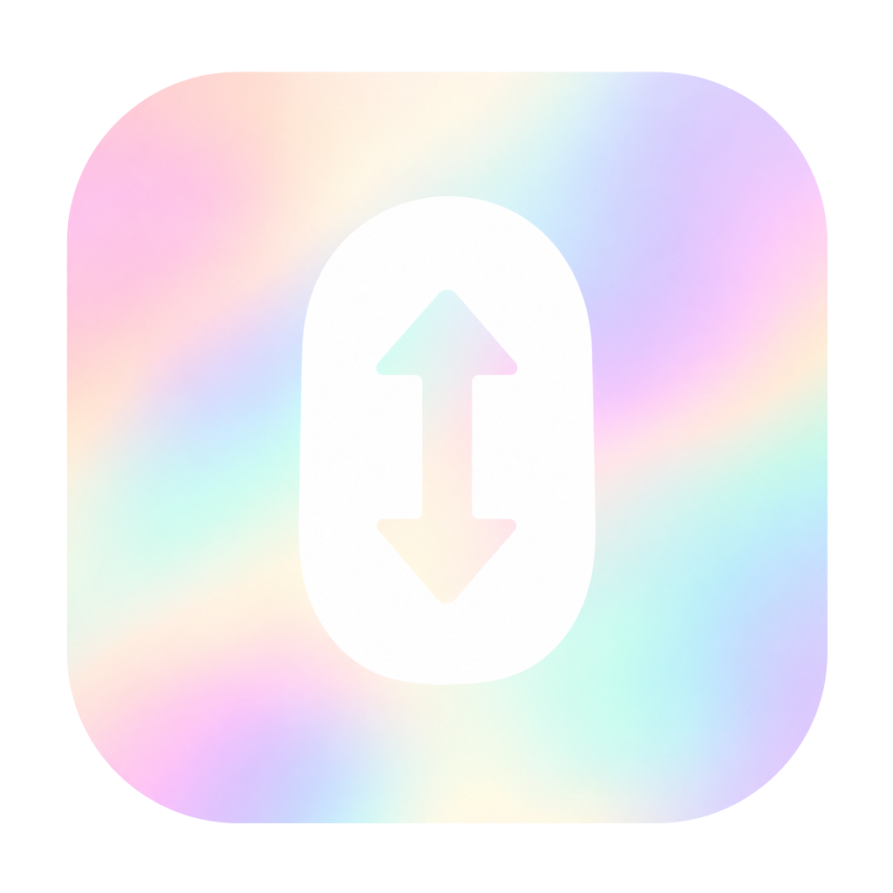
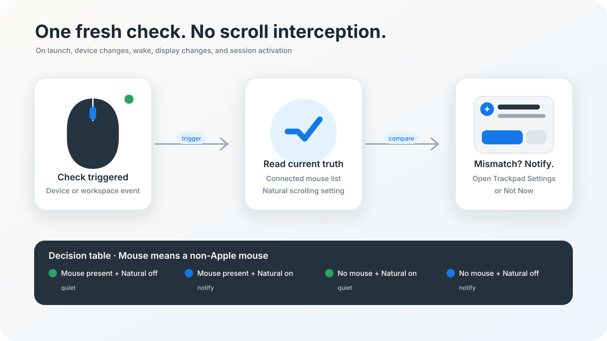

<p align="center">
  
</p>

<h1 align="center">Mouse Scroll Switcher</h1>

<p align="center">
  A tiny macOS reminder that keeps Natural scrolling sensible when you switch between a trackpad and a non-Apple mouse.
</p>



## What it does

Mouse Scroll Switcher checks the current devices and Natural scrolling preference at launch, when a mouse connects or disconnects, after system or screen wake, when the display configuration changes, and when your user session becomes active again.

Automatic events arriving close together share one check a second after the last event, allowing devices to settle after waking or undocking. The menu-bar mouse icon shows that the app is running. Its menu shows the last check time and result, and offers **Check Now**, **Open Trackpad Settings**, and **Quit**. **Check Now** runs immediately.

| Current devices | Expected setting | Result when matched |
| --- | --- | --- |
| A non-Apple mouse is connected | Natural scrolling off | Quiet |
| No non-Apple mouse is connected | Natural scrolling on | Quiet |

When they do not match, a persistent notification offers two choices: **Open Trackpad Settings** or **Not Now**. The first opens Trackpad → Scroll & Zoom directly.

It does not intercept scrolling, install an event tap, require Accessibility permission, poll in the background, or silently modify a system setting.

## Install

Download `MouseScrollSwitcher-v1.0.0.zip` from the latest release, unzip it, and move the app to Applications. Because v1 is ad-hoc signed rather than notarized, macOS may require **Control-click → Open** on first launch.

Allow notifications when prompted. For notifications that remain visible until acted on, macOS should use **Alerts** for Mouse Scroll Switcher in System Settings → Notifications.

Add the app to System Settings → General → Login Items if you want it to run after login.

## Build from source

Requires macOS 14 or newer and Xcode Command Line Tools.

```sh
make test
make
open MouseScrollSwitcher.app
```

The project also includes a Swift package manifest for editor indexing.

Tests cover the decision table and post wake/display/session notifications inside
the test process to verify settling and manual checks. They require a macOS user
session and do not change system preferences or display notifications.

## How small is it?

The production app has four Swift files:

- `main.swift` wires up the accessory app.
- `Core.swift` listens for HID, wake, display, and session events and makes the stateless decision.
- `Notification.swift` presents the notification and opens System Settings.
- `MenuBar.swift` presents the running status, last check, and menu actions.

The HID matching API is public. Reading `com.apple.swipescrolldirection` and opening an `x-apple.systempreferences:` deep link rely on undocumented macOS behavior and may need adjustment on a future release.

## License

MIT
